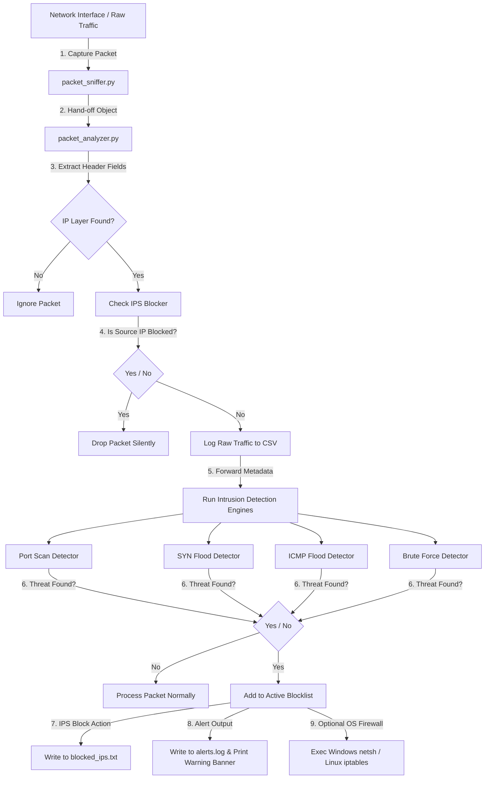

# Network IDS & IPS - Comprehensive User Manual

A lightweight, modular, and thread-safe **Network Intrusion Detection System (IDS) & Intrusion Prevention System (IPS)** built in Python using Scapy. It captures real-time network traffic, evaluates header attributes against dynamic signature thresholds, logs warnings, and blocks threatening hosts.

---

## 🛠️ Complete Project Directory Structure

```text
ids_ips_project/
│
├── main.py                     # Central coordinator & orchestrator
├── requirements.txt            # Python dependencies (scapy, colorama)
├── README.md                   # Professional user manual & guide
├── simulate_attacks.py         # Attack generator & packet injector
├── test_ids_ips.py             # Complete logic validation suite
│
├── config/
│   └── settings.py             # Alert thresholds & block window settings
│
├── sniffer/
│   └── packet_sniffer.py       # Threaded raw socket sniffer with fallback listener
│
├── analyzer/
│   └── packet_analyzer.py      # Layer extraction & header field decoder
│
├── detection/
│   ├── port_scan_detector.py   # Signature module: Port Scan attacks
│   ├── syn_flood_detector.py   # Signature module: TCP SYN flood DDoS attacks
│   ├── icmp_flood_detector.py  # Signature module: ICMP Ping flood attacks
│   └── brute_force_detector.py # Signature module: Rapid SSH/FTP brute force
│
├── prevention/
│   └── blocker.py              # IPS Block Engine & system firewall rules
│
├── logger/
│   └── logger.py               # Writes persistent .log alerts & forensics CSV
│
├── storage/
│   ├── blocked_ips.txt         # Blocked attacker IP addresses
│   ├── alerts.log              # Human readable security events log
│   └── traffic_data.csv        # Raw traffic statistics CSV
│
└── utils/
    ├── helpers.py              # Banners, log wrappers, and IP check functions
    └── time_utils.py           # Timing utilities for sliding epoch windows
```

---

## 💡 System Architecture and Workflow



---

## ⚡ Quick Setup & Dependency Installation

### 🐧 On Linux (Debian/Ubuntu/CentOS/RedHat)
To sniff raw network interfaces directly, Scapy requires administrator privileges.
```bash
# 1. Update packages and install python pip & libpcap if missing
sudo apt-get update
sudo apt-get install python3-pip libpcap-dev -y

# 2. Install Python dependencies
pip3 install -r requirements.txt
```

### 🪟 On Windows
1. Install **Npcap** or **WinPcap** in "WinPcap compatibility mode" from the official site (https://npcap.com/) to capture live packets from your network cards.
2. Install Python dependencies in an elevated/Administrator PowerShell window:
```powershell
pip install -r requirements.txt
```

---

## 🧪 Testing the Project

There are two primary ways to test and verify the operational integrity of the system.

### Option A: Run the Offline Logic Validation Suite (Self-Contained)
Runs pre-constructed network data structures through the analyzers, detectors, and loggers. This guarantees that all subsystems are functional without opening live sockets or injecting packets into the host routing layer.
```bash
python3 test_ids_ips.py
```
*If everything is configured correctly, this will finish with:*
`ALL TESTS COMPLETED SUCCESSFULLY! CORE LOGIC VALIDATED.`

### Option B: Run a Real-Time Interactive Attack Simulation
To see the system catch real/simulated packet injectors:

1. **Start the security engine** in Terminal 1:
   * **Linux:**
     ```bash
     sudo python3 main.py
     ```
   * **Windows (Administrator PowerShell):**
     ```powershell
     python main.py
     ```
2. **Start the attack simulator** in Terminal 2:
   ```bash
   python3 simulate_attacks.py
   ```
3. Select an attack from the simulator menu `[1-5]` (e.g. `5` to run all attacks).
4. Watch the live console alerts in Terminal 1 block the attackers and write forensic metadata to disk.

---

## ⚙️ Threshold Configurations

All attack thresholds are customized in [config/settings.py](file:///d:/ids%20ips/config/settings.py):

* **Port Scan:** Triggered when an IP scans `PORT_SCAN_THRESHOLD` unique ports within `PORT_SCAN_WINDOW` seconds.
* **SYN Flood:** Triggered when an IP sends `SYN_FLOOD_THRESHOLD` TCP SYN packets within `SYN_FLOOD_WINDOW` seconds.
* **ICMP Flood:** Triggered when an IP sends `ICMP_FLOOD_THRESHOLD` ICMP Echo Request pings within `ICMP_FLOOD_WINDOW` seconds.
* **Brute-Force:** Triggered when an IP initiates `BRUTE_FORCE_THRESHOLD` connections targeting standard authentication ports (`21` FTP, `22` SSH, `23` Telnet) within `BRUTE_FORCE_WINDOW` seconds.
* **Active Blocking:** The ban duration is defined by `BLOCK_TIME` (in seconds). Set to `0` for permanent bans.
* **Active OS Firewall Hook:** Set `EXECUTE_SYSTEM_BLOCK = True` inside `config/settings.py` to automatically configure `iptables` rules on Linux or `netsh` rules on Windows.