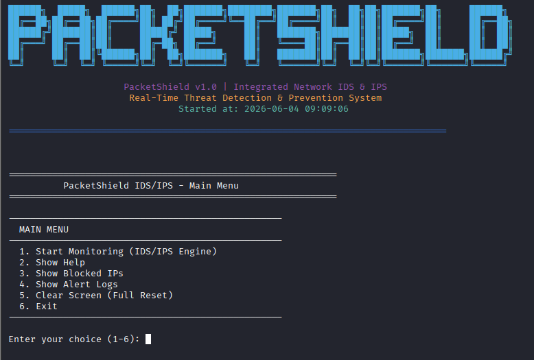
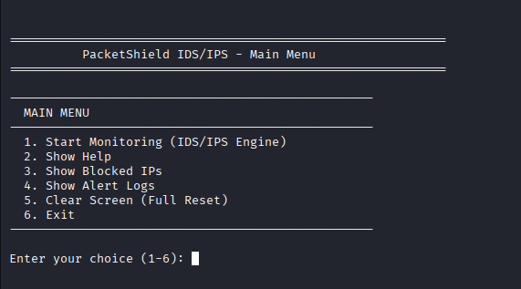
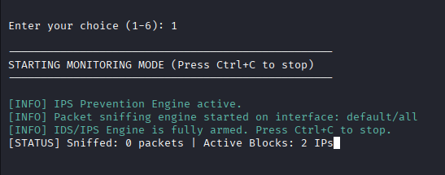
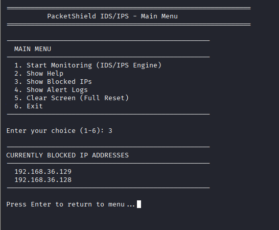
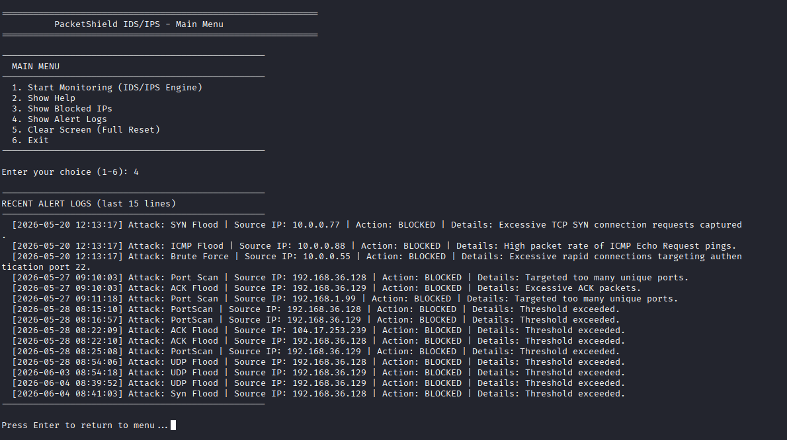

# PacketShield - Integrated Network IDS/IPS

PacketShield is a Python-based Intrusion Detection and Prevention System (IDS/IPS) that monitors network traffic, detects malicious activities, generates security alerts, and automatically blocks suspicious hosts.

---

## Features

### Intrusion Detection

* Port Scan Detection
* SYN Flood Detection
* ICMP Flood Detection
* UDP Flood Detection
* ACK Flood Detection
* Brute Force Detection
* DNS Amplification Detection
* ARP Spoof Detection
* DDoS Detection

### Intrusion Prevention

* Automatic IP Blocking
* Persistent Block List
* Real-Time Alert Generation
* Security Event Logging

### Monitoring

* Real-Time Monitoring Mode
* Packet Statistics Tracking
* Blocked IP Management
* Alert Log Viewer
* Interactive CLI Interface

---

## Screenshots

### PacketShield Banner



### Main Menu



### Monitoring Mode



### Blocked IP Management



### Alert Log Viewer



---

## Detection Engines

PacketShield currently supports:

* Port Scan Detection
* SYN Flood Detection
* ICMP Flood Detection
* UDP Flood Detection
* ACK Flood Detection
* Brute Force Detection
* DNS Amplification Detection
* ARP Spoof Detection
* DDoS Detection

---

## Project Structure

```text
PacketShield/
│
├── analyzer/
├── config/
├── detection/
├── logger/
├── prevention/
├── sniffer/
├── storage/
├── utils/
│
├── main.py
├── requirements.txt
├── simulate_attacks.py
└── test_ids_ips.py
```

---

## Installation

```bash
git clone https://github.com/Lingam-Subhash/PacketShield-IDS-IPS.git
cd PacketShield-IDS-IPS
pip install -r requirements.txt
python main.py
```

---

## Supported Platforms

* Linux (Recommended)
* Kali Linux
* Ubuntu
* Windows

---

## Future Roadmap

* Live Packet Capture Mode
* Advanced Traffic Analytics
* Threat Intelligence Integration
* Web Dashboard
* Report Generation
* Enhanced Detection Accuracy

---

## Disclaimer

PacketShield is intended for educational, research, and defensive cybersecurity purposes only.
